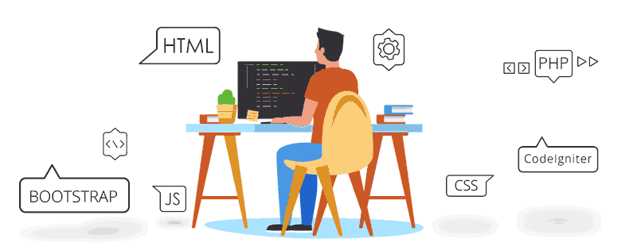

## 
Hi👋 Peyman Hadavi

## 
FrontEnd Developer

 

---

<h3 align="left">Languages and Tools:</h3>

 
  &nbsp; &nbsp; &nbsp; &nbsp;
 &nbsp; &nbsp; &nbsp; &nbsp;
 &nbsp; &nbsp; &nbsp; &nbsp;
 &nbsp; &nbsp; &nbsp; &nbsp;
 &nbsp; &nbsp; &nbsp; &nbsp; 
 &nbsp; &nbsp; &nbsp; &nbsp; 
 &nbsp; &nbsp; &nbsp; &nbsp; 
 &nbsp; &nbsp; &nbsp; &nbsp; 
 &nbsp; &nbsp; &nbsp; &nbsp; 
 &nbsp; &nbsp; &nbsp; &nbsp; 
 &nbsp; &nbsp; &nbsp; &nbsp; 
 &nbsp; &nbsp; &nbsp; &nbsp; 
 &nbsp; &nbsp; &nbsp; &nbsp; 
 &nbsp; &nbsp; &nbsp; &nbsp; 
 &nbsp; &nbsp; &nbsp; &nbsp; 
 &nbsp; &nbsp; &nbsp; &nbsp; 
 &nbsp; &nbsp; &nbsp; &nbsp; 
 &nbsp; &nbsp; &nbsp; &nbsp; 
 &nbsp; &nbsp; &nbsp; &nbsp; 
 &nbsp; &nbsp; &nbsp; &nbsp; 
 &nbsp; &nbsp; &nbsp; &nbsp; 

---

<h3 align="left">Social Media & Ways of communication:</h3>

  &nbsp; &nbsp; &nbsp; &nbsp;
  &nbsp; &nbsp; &nbsp; &nbsp;
  &nbsp; &nbsp; &nbsp; &nbsp;
  &nbsp; &nbsp; &nbsp; &nbsp;
  &nbsp; &nbsp; &nbsp; &nbsp;
   
 

---

 
